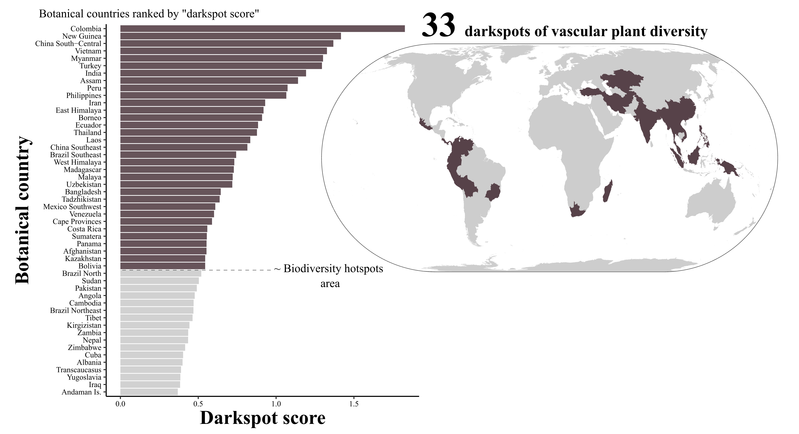

<!-- README.md is generated from README.Rmd. Please edit that file -->

[](https://www.gnu.org/licenses/gpl-3.0)

# What are the plant diversity darkspots ?

Vascular plant diversity darkspots are represented by botanical
countries exhibiting the highest darkspot score, computed from the
number of species remaining to be described and geolocated at a
cumulative area comparable to that of biodiversity hotspots (Ondo, I.,
Dhanjal-Adams and K.L., Pironon, S., 2024).  
See the following links for more information:

- **State of the World’s Plants and Fungi Symposium 2023: Day 2**  
  [2023SOTWPF](https://www.youtube.com/watch?v=Ya_9t2TxQFw "2023SOTWPF")

- **Lights on plant diversity ‘darkspots’**  
  [UNEP-WCMC
  News](https://unep-wcmc.org/en/news/unep-wcmc-scientists-shed-light-on-plant-diversity-darkspots-for-major-new-report)
  <br>

 <br>

# darkspotdiv

`darkspotdiv` is a package primarily developed to facilitate the
reproduction of the time-to-event analyses conducted in the article
[**“Plant diversity darkspots for global collection
priorities”**](https://doi.org/10.1111/nph.20024) by Ondo, I.,
Dhanjal-Adams and K.L., Pironon, S. (2024), to model the number of
vascular plant species remaining undescribed and/or nongeolocated per
“botanical countries”. The package contains a set of scripts to *fit*,
*assess* and *predict* the proportion of species remaining to be
described and geolocated in a *botanical country* as a function of
species characteristics. The scripts rely on time-to-event data
available at doi:
[*10.5281/zenodo.11110630*](https://zenodo.org/records/11110630). 

## Installation

Make sure to have [*R*](https://cloud.r-project.org/ "R") or
[*Rstudio*](https://rstudio.com/products/rstudio/download/ "Rstudio")
installed on your machine. Some R packages need to be compiled from
source, so if you are on Windows, you need to install
[*Rtools*](http://cran.r-project.org/bin/windows/Rtools/) too.  

Install *darkspotdiv* with the following instructions. If the package
`devtools` is not already installed run `install.packages("devtools")`
in your console.

Then, install and load the package:

``` r
devtools::install_github("DarkSpots/darkspotdiv")
library(darkspotdiv)
```

# references

Ondo, I., Dhanjal-Adams, K.L., Pironon, S., Silvestro, D., Colli-Silva,
M., Deklerck, V., Grace, O.M., Monro, A.K., Nicolson, N., Walker, B. and
Antonelli, A. (2024), Plant diversity darkspots for global collection
priorities. New
Phytol.[*https://doi.org/10.1111/nph.20024*](https://doi.org/10.1111/nph.20024)
